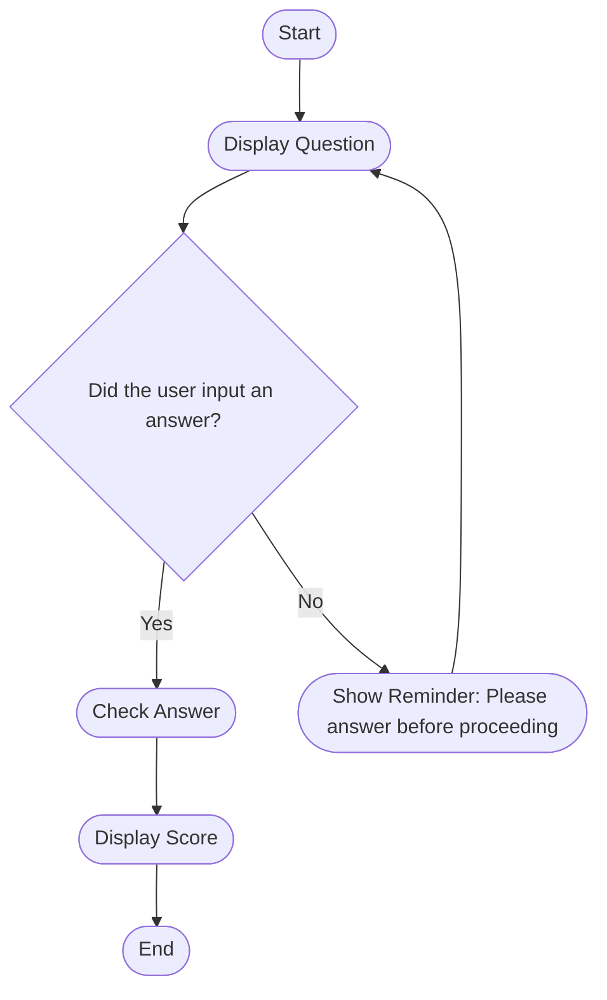

```mermaid
flowchart TD
    A([Start]) --> B([Display Question])
    B --> C{Did the user input an answer?}
    C -->|Yes| D([Check Answer])
    C -->|No| E([Show Reminder: Please answer before proceeding])
    E --> B
    D --> F([Display Score])
    F --> G([End])
```
