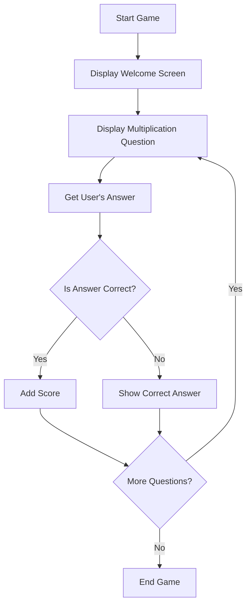

```markdown
# Multiplication Quiz Game - Flowchart


```mermaid
flowchart TD
    A[Start Game] --> B[Display Welcome Screen]
    B --> C[Display Multiplication Question]
    C --> D[Get User's Answer]
    D --> E{Is Answer Correct?}
    E -- Yes --> F[Add Score]
    E -- No --> G[Show Correct Answer]
    F --> H{More Questions?}
    G --> H
    H -- Yes --> C
    H -- No --> I[End Game]
```
```
