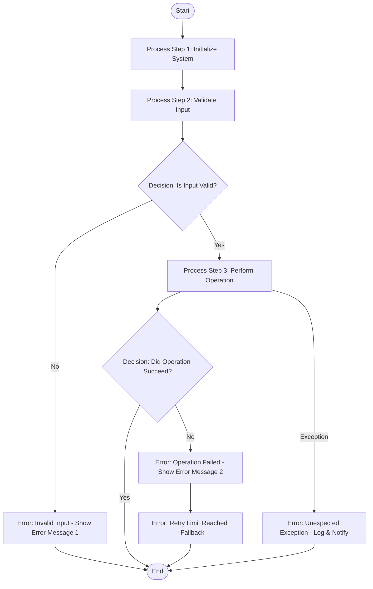

```mermaid
flowchart TD
    A([Start])
    B1[Process Step 1: Initialize System]
    B2[Process Step 2: Validate Input]
    B3[Process Step 3: Perform Operation]
    D1{Decision: Is Input Valid?}
    D2{Decision: Did Operation Succeed?}
    E1[Error: Invalid Input - Show Error Message 1]
    E2[Error: Operation Failed - Show Error Message 2]
    E3[Error: Retry Limit Reached - Fallback]
    E4[Error: Unexpected Exception - Log & Notify]
    F([End])

    A --> B1 --> B2 --> D1
    D1 -- Yes --> B3 --> D2
    D1 -- No --> E1 --> F
    D2 -- Yes --> F
    D2 -- No --> E2 --> E3
    E3 --> F
    B3 -- Exception --> E4 --> F
```
- **Error Scenarios:**
  1. Invalid input (Error Message 1)
  2. Operation failure (Error Message 2)
  3. Retry limit reached (Fallback)
  4. Unexpected exception (Log & Notify)
