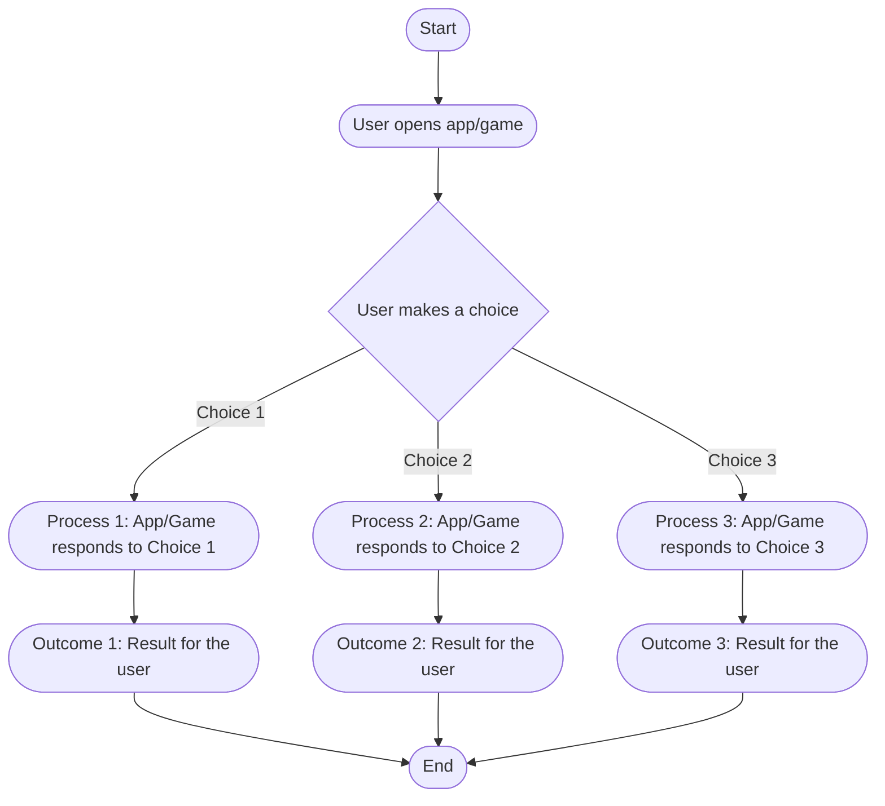

# LoL

```mermaid
flowchart TD
    A([Start]) --> B([User opens app/game])
    B --> C{User makes a choice}
    C -->|Choice 1| D([Process 1: App/Game responds to Choice 1])
    C -->|Choice 2| E([Process 2: App/Game responds to Choice 2])
    C -->|Choice 3| F([Process 3: App/Game responds to Choice 3])
    D --> G([Outcome 1: Result for the user])
    E --> H([Outcome 2: Result for the user])
    F --> I([Outcome 3: Result for the user])
    G --> J([End])
    H --> J
    I --> J
```
